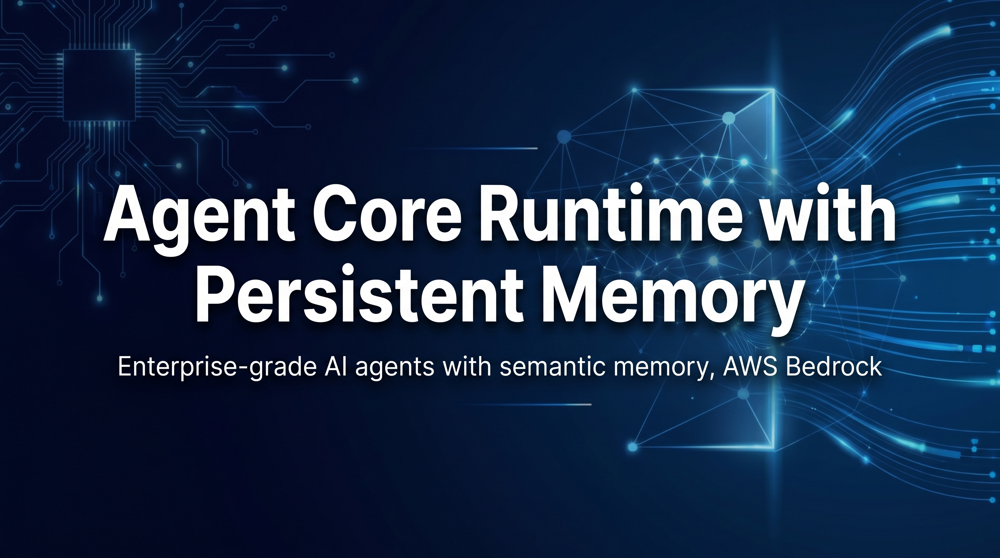
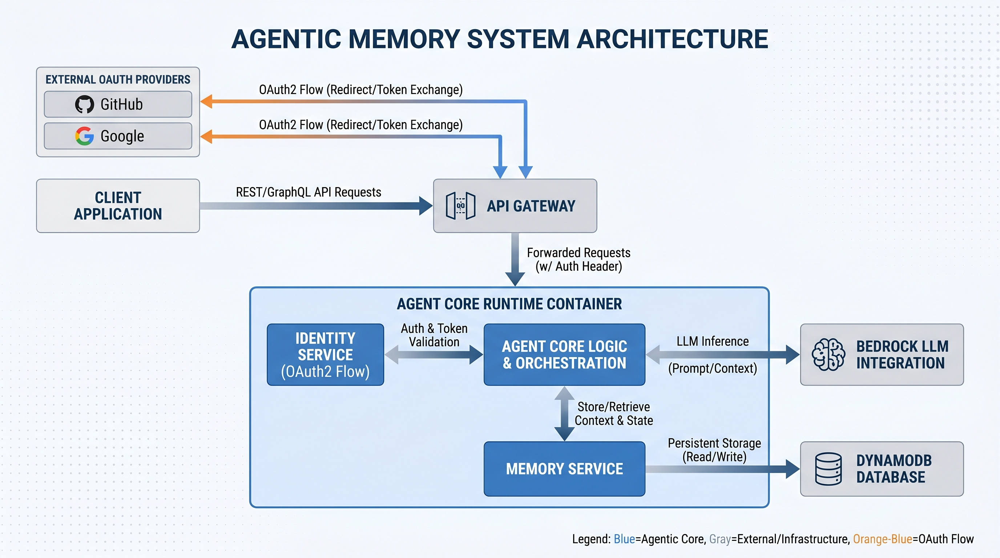

# Agent Core Runtime with Persistent Memory



> **Production-ready reference implementation for AI agents with enterprise memory management, OAuth2 identity, and semantic retrieval on AWS Bedrock**


## Problem & Solution

Most AI agents are **stateless**. Each request has no memory of prior interactions, forcing agents to repeat context, miss patterns, and fail at long-running tasks.

**Agent Core Runtime** solves this with **persistent memory across three layers**:
- **Event Log** — Raw interactions (timestamped, queryable)
- **Summary Memory** — Extracted patterns and policies (updated hourly)
- **Semantic Memory** — Vector embeddings for similarity search (always fresh)

Result: Agents that remember, learn, and reason over accumulated context — no code needed.

---

## ✨ Core Features

### 🧠 **Three-Layer Memory System**
- **Event Log**: Raw interactions with automatic TTL (30-90 days configurable)
- **Summary Memory**: Periodic pattern extraction, aggregated views, lower cost
- **Semantic Memory**: Vector embeddings via DynamoDB native search, instant recall

### 🔐 **Multi-Provider Identity**
- OAuth2 support (GitHub, Google, GitLab, custom OIDC)
- Per-user credential vault with KMS encryption
- PKCE flow for secure token exchange
- Session isolation and token refresh

### 🚀 **Enterprise Ready**
- Containerized on AWS ECS Fargate
- Zero-trust security model
- Comprehensive audit logging
- Automatic failover and circuit breakers

### 📊 **Semantic Search**
- Natural language queries over agent history
- Confidence scoring for retrieved memories
- Relevance ranking by interaction recency

---

## Quick Start

### Prerequisites
- Node.js 18+ or Python 3.11+
- AWS Account with AdministratorAccess (for setup; reduces to least-privilege after)
- Docker (optional, for container deployment)

### 1. Installation (2 minutes)

```bash
git clone https://github.com/johnruiz24/agentcore-memory.git
cd agentcore-memory

# Setup environment
cp config/.env.example .env
# Edit .env with AWS credentials (replace {{PLACEHOLDERS}})

npm install
npm test
```

### 2. Your First Memory Capture

```typescript
import { AgentCoreSharedMemoryPocStack } from './lib/agentcore-shared-memory-poc-stack';

// Deploy with CDK
const stack = new AgentCoreSharedMemoryPocStack(app, 'AgentMemory', {
  writerModelId: 'eu.anthropic.claude-haiku-4-5-20251001-v1:0',
  readerModelId: 'eu.anthropic.claude-haiku-4-5-20251001-v1:0'
});

// CloudFormation generates:
// - Shared memory (DynamoDB)
// - Writer runtime (stores interactions)
// - Reader runtime (retrieves memory)
// - OAuth2 endpoints
```

### 3. Run Tests

```bash
npm test           # All tests pass ✓
npm run synth      # CloudFormation template generated
npm run lint       # Code style verified
```

---

## System Architecture



**Components:**
1. **Agent Core Runtime** — Main processor, orchestrates memory and LLM calls
2. **Memory Service** — DynamoDB-backed three-layer storage (event log + summary + semantic)
3. **Identity Service** — OAuth2 provider, token vault, per-user isolation
4. **API Gateway** — HTTPS endpoint, rate limiting, authentication
5. **Bedrock Integration** — Claude LLM inference (Haiku for cost-efficiency)

See [ARCHITECTURE.md](./ARCHITECTURE.md) for full component details and data flows.

---

## Documentation

| Document | Purpose |
|----------|---------|
| [ARCHITECTURE.md](./ARCHITECTURE.md) | System design, component interactions, data models |
| [SETUP.md](./SETUP.md) | Installation, AWS configuration, deployment procedures |
| [EXAMPLES.md](./EXAMPLES.md) | Code examples, common patterns, runnable demos |
| [CONTRIBUTING.md](./CONTRIBUTING.md) | Development guidelines, testing requirements |
| [AGENTS.md](./AGENTS.md) | Repository structure and organization |

---

## Memory Lifecycle

### Writing (Agent → Storage)
```
Agent generates response
  ↓
Extract key facts and entities
  ↓
Route to three parallel stores:
  • Raw event → Event Log (JSON + metadata)
  • Aggregated pattern → Summary Memory (hourly)
  • Vectorized embedding → Semantic Memory (DynamoDB)
```

### Reading (Query → Response)
```
Query arrives with namespace
  ↓
Three parallel retrievals:
  • Semantic search (top-10 by similarity)
  • Recent events (chronological, last 50)
  • Summary patterns (aggregated trends)
  ↓
Merge results with confidence scoring
  ↓
Populate context window (optimized for token limits)
```

See [docs/diagrams/memory-flow.png](./docs/diagrams/memory-flow.png) for visual representation.

---

## Configuration

All configuration is environment-based. See [config/.env.example](./config/.env.example) for complete reference.

### Essential Variables

```bash
# AWS
AWS_REGION=eu-central-1
AWS_ACCOUNT_ID={{ACCOUNT_ID}}

# Memory Storage
TABLE_MEMORY_STORE={{TABLE_NAME}}    # DynamoDB
TABLE_SESSIONS={{TABLE_NAME}}         # Session table

# Models
BEDROCK_MODEL_ID=eu.anthropic.claude-haiku-4-5-20251001-v1:0
BEDROCK_REGION=eu-central-1

# Identity
COGNITO_POOL_ID={{POOL_ID}}
COGNITO_CLIENT_ID={{CLIENT_ID}}
OAUTH_REDIRECT_URI=https://example.com/callback
```

---

## Usage Examples

### Example 1: Persist an Interaction

```typescript
import { MemoryService } from './src/memory/service';

const memory = new MemoryService();

await memory.capture({
  sessionId: 'session-abc123',
  agentId: 'agent-1',
  interaction: {
    input: 'What is the cost of EC2 instances in eu-central-1?',
    output: 'EC2 instances range from $0.05/hour for t3.nano to $4.58/hour for c5.4xlarge',
    timestamp: new Date().toISOString(),
    metadata: {
      model: 'claude-haiku',
      tokens: { input: 45, output: 23 },
      cost: 0.0012
    }
  }
});
```

### Example 2: Semantic Search Over History

```typescript
const relatedMemories = await memory.semanticSearch({
  query: 'cost optimization strategies for compute resources',
  sessionId: 'session-abc123',
  limit: 10
});

relatedMemories.forEach(memory => {
  console.log(`[${memory.similarity.toFixed(2)}] ${memory.interaction.output}`);
});

// Output:
// [0.92] EC2 instances range from $0.05/hour for t3.nano...
// [0.87] Reserved Instances provide 40% discount for 1-year commitments...
// [0.81] Spot Instances offer 90% savings but with interruption risk...
```

### Example 3: Multi-Turn Conversation with Context

```typescript
// Agent loads memory context before responding
const context = await memory.getContext({
  sessionId: 'user-123',
  limit: 5  // Last 5 interactions
});

const response = await agent.invoke({
  input: 'What did I ask about yesterday?',
  context: context,  // Automatically included in prompt
  memoryId: shared_memory.id
});

// Agent response now includes memory:
// "Yesterday you asked about EC2 pricing in eu-central-1..."
```

For more examples, see [EXAMPLES.md](./EXAMPLES.md).

---

## Testing

```bash
# All tests
npm test

# Specific test file
npm test -- src/memory/service.test.ts

# With coverage report
npm test -- --coverage

# End-to-end (requires AWS credentials)
npm run e2e

# Integration test (smoke test for AWS resources)
npm run smoke
```

---

## Deployment

### Local Development

```bash
npm run build     # Compile TypeScript
npm run synth     # Generate CloudFormation
npm run deploy    # Deploy to AWS
```

### Docker

```bash
docker build -t agentcore-memory:latest .
docker run -p 8080:8080 \
  -e AWS_REGION=eu-central-1 \
  -e BEDROCK_MODEL_ID=eu.anthropic.claude-haiku-4-5-20251001-v1:0 \
  agentcore-memory:latest
```

### AWS ECS Fargate (Recommended)

See [SETUP.md](./SETUP.md#ecs-deployment) for CloudFormation stack deployment.

---

## Security

✅ **Built-in security practices:**
- All credentials stored in AWS Secrets Manager (KMS encrypted)
- Per-user access control via Identity Service
- OAuth2 token validation on every request
- Audit logging for all memory operations
- Network isolation via VPC security groups
- TLS 1.3 for all communications

See [SETUP.md#security](./SETUP.md#security) for detailed security configuration.

---

## Troubleshooting

### Memory queries timeout

**Symptom**: Semantic search takes >5 seconds  
**Solution**: Scale DynamoDB throughput or enable DynamoDB Accelerator (DAX)  
See [SETUP.md#scaling](./SETUP.md#scaling)

### OAuth2 provider integration fails

**Symptom**: "Invalid OAuth credentials" error  
**Solution**: Verify credentials in `.env`, ensure redirect URI matches provider configuration  
See [EXAMPLES.md#oauth2](./EXAMPLES.md#oauth2-flow)

### Agent not persisting state

**Symptom**: Memory reads return empty results  
**Solution**: Verify IAM role has `dynamodb:PutItem` and `dynamodb:Query` permissions  
See [SETUP.md#iam](./SETUP.md#iam-permissions)

For more help: [GitHub Issues](https://github.com/johnruiz24/agentcore-memory/issues) | [Discussions](https://github.com/johnruiz24/agentcore-memory/discussions)

---

## Contributing

We welcome contributions! Please read [CONTRIBUTING.md](./CONTRIBUTING.md) for:
- Development setup
- Code style and conventions
- Test requirements (80%+ coverage)
- PR submission process

Quick contribution flow:
```bash
git checkout -b feat/my-feature
npm run build && npm test  # Verify locally
git push origin feat/my-feature
# → Open Pull Request
```

---

## License

MIT License — see [LICENSE](./LICENSE) for details.

---

## Acknowledgments

- Built with **AWS Bedrock** (Claude models)
- Inspired by **agentcore-identity** reference implementation
- Community contributions from [contributors](./CONTRIBUTING.md)

---

## Next Steps

- **New to the project?** Start with [Quick Start](#quick-start) above
- **Want to understand the architecture?** Read [ARCHITECTURE.md](./ARCHITECTURE.md) and view [docs/diagrams/](./docs/diagrams/)
- **Building a feature?** Check [EXAMPLES.md](./EXAMPLES.md) for patterns
- **Deploying to production?** Follow [SETUP.md](./SETUP.md#deployment)
- **Contributing?** See [CONTRIBUTING.md](./CONTRIBUTING.md)

---

**Questions?** Start with [SETUP.md](./SETUP.md#faq) or [GitHub Issues](https://github.com/johnruiz24/agentcore-memory/issues).
